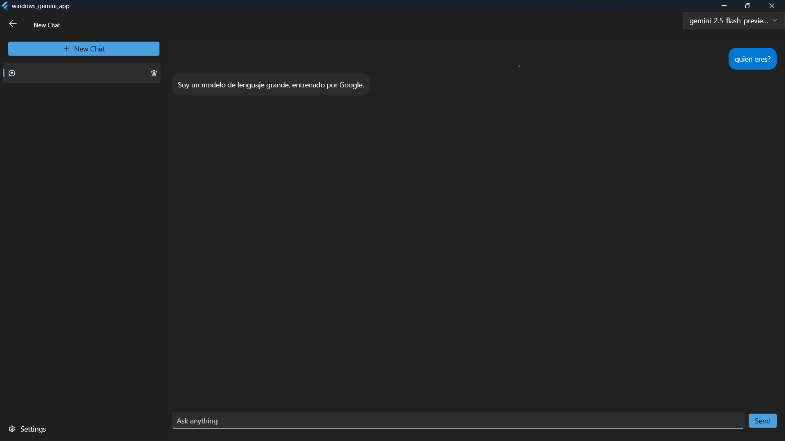

# Gemini Chat App para Windows

Una aplicación de escritorio para Windows, creada con Flutter por **David Menéndez Acosta**, que te permite interactuar con la API de Gemini de Google. La aplicación cuenta con una interfaz nativa de Windows gracias al paquete `fluent_ui` y guarda el historial de conversaciones localmente usando la base de datos Isar.



---

## ✨ Características

-   **Interfaz Nativa de Windows**: Diseñada con el Fluent Design System para una integración perfecta en el escritorio de Windows.
-   **Chat con Contexto**: Mantén conversaciones fluidas. La aplicación envía el historial de la conversación actual para que el modelo recuerde el contexto.
-   **Selector de Modelos**: Elige entre varios de los modelos más recientes de Gemini para adaptar la respuesta a tus necesidades.
-   **Persistencia Local**: Todas tus conversaciones se guardan en una base de datos local (Isar). Cierra la aplicación y retoma tus chats donde los dejaste.
-   **Múltiples Chats**: Organiza tus conversaciones en diferentes chats.
-   **Crear y Eliminar Chats**: Gestiona tu historial de conversaciones de manera sencilla.

---

## 🛠️ Tecnologías Utilizadas

-   **Framework**: [Flutter](https://flutter.dev/)
-   **Lenguaje**: [Dart](https://dart.dev/)
-   **Diseño de UI**: [fluent_ui](https://pub.dev/packages/fluent_ui) para la apariencia nativa de Windows.
-   **Base de Datos Local**: [Isar](https://pub.dev/packages/isar) - Una base de datos NoSQL súper rápida para Flutter.
-   **Llamadas a la API**: [http](https://pub.dev/packages/http)
-   **Gestión de Secretos**: [flutter_dotenv](https://pub.dev/packages/flutter_dotenv)

---

## 🚀 Cómo Empezar

Sigue estos pasos para configurar y ejecutar el proyecto en tu máquina local.

### Prerrequisitos

-   Tener el [SDK de Flutter](https://flutter.dev/docs/get-started/install) instalado.
-   Tener configurado el entorno para desarrollar aplicaciones de Windows con Flutter. Puedes verificarlo con `flutter doctor`.
-   Una clave de API de Google Gemini. La puedes obtener en [Google AI Studio](https://ai.google.dev/).

### Instalación

1.  **Clona el repositorio:**
    ```sh
    git clone https://URL_DEL_REPOSITORIO.git
    cd NOMBRE_DEL_DIRECTORIO
    ```

2.  **Crea el archivo de entorno:**
    En la raíz del proyecto, crea un archivo llamado `.env` y añade tu clave de API de la siguiente manera:
    ```
    GEMINI_API_KEY=TU_CLAVE_API_AQUI
    ```

3.  **Instala las dependencias:**
    Ejecuta el siguiente comando para descargar todos los paquetes necesarios.
    ```sh
    flutter pub get
    ```

4.  **Genera los archivos de la base de datos:**
    Isar necesita generar archivos de código. Ejecuta este comando:
    ```sh
    flutter pub run build_runner build --delete-conflicting-outputs
    ```

5.  **Ejecuta la aplicación:**
    Asegúrate de tener seleccionado un dispositivo de Windows y ejecuta:
    ```sh
    flutter run
    ```

---

## 📂 Estructura del Proyecto

El código está organizado siguiendo una arquitectura limpia para facilitar su mantenimiento y escalabilidad:

```
/
|-- lib/
|   |-- src/
|   |   |-- core/         # Lógica de negocio (servicios de API, base de datos)
|   |   |-- model/        # Modelos de datos (Chat, Message)
|   |   `-- view/         # Widgets de la interfaz de usuario (la pantalla principal)
|   |-- main.dart         # Punto de entrada de la aplicación
|-- .env                  # Archivo para las claves de API (debe ser creado)
|-- pubspec.yaml          # Dependencias del proyecto
`-- README.md             # Este archivo
```

---

## 👨‍💻 Autor

-   **David Menéndez Acosta**
    -   [LinkedIn](https://www.linkedin.com/in/davidmenendez9901/)
    -   [Telegram](https://t.me/davidmenendez9901)

---

## 🤝 Contribuciones

Las contribuciones son bienvenidas. Si tienes ideas para mejorar la aplicación, por favor abre un *issue* para discutirlo o envía directamente un *pull request*.

---

## 📄 Licencia

Este proyecto está bajo la Licencia MIT. Ver el archivo `LICENSE` para más detalles.
